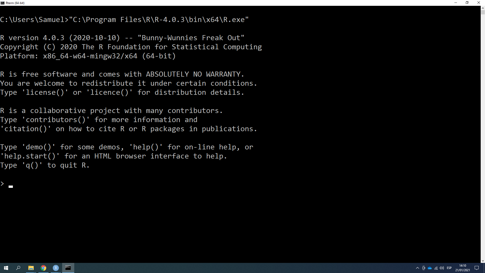
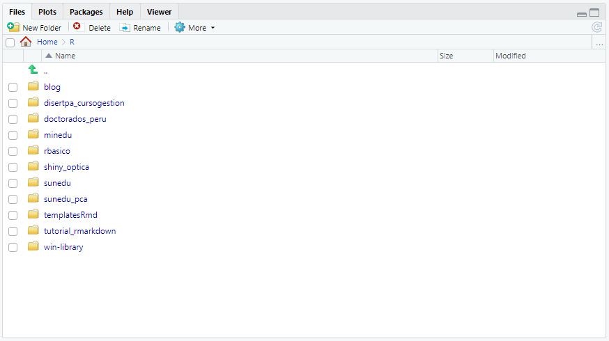

```{r setup, include=FALSE}
knitr::opts_chunk$set(echo = FALSE)
```

## Software requerido

Para la presente sesión es necesario contar con el siguiente software instalado:

1.  R programming language (versión 4.0.0 o superior)
2.  RStudio IDE (versión 1.4.0 o superior)

También se necesitan los siguientes paquetes de R:

1.  tidyverse
2.  rmarkdown

# La consola de R

## R en la terminal

R es un lenguaje de programación. Como todo lo que ocurre en una computadora, puede ejecutarse en una ventana de terminal. En Windows la conocemos como la ventana de comandos.

------------------------------------------------------------------------

{width="100%"}

------------------------------------------------------------------------

Es posible acceder a la consola de R desde una terminal.

-   Windows: escribir la ubicación del ejecutable de R
-   Mac o Linux: escribir `R`

------------------------------------------------------------------------

{width="100%"}

------------------------------------------------------------------------

{width="100%"}

# El editor de código RStudio

------------------------------------------------------------------------

Generalmente, no será necesario acceder a R a través de una terminal porque lo haremos utilizando el entorno de programación RStudio, que nos brinda una consola de R automáticamente (aunque tras bambalinas realiza previamente el procedimiento explicado).

------------------------------------------------------------------------

{width="100%"}

## Asignar directorio de trabajo general

El directorio de trabajo general es la carpeta en la que guardamos nuestros trabajos realizados con R. Por defecto, es la carpeta de "Documentos" del usuario de la computadora.

RStudio cuenta con un explorador de archivos para revisar el contenido de nuestros directorios.

------------------------------------------------------------------------

{width="100%"}

------------------------------------------------------------------------

Mi recomendación personal es utilizar como directorio general la carpeta llamada "R" dentro de "Documentos".

1.  Acceder a "Global options" dentro del Menú "Tools".
2.  En las opciones generales, elegir la carpeta "R" como *Default working directory*.

------------------------------------------------------------------------

{width="100%"}

------------------------------------------------------------------------

{height="100%"}

## EL directorio de trabajo

El directorio de trabajo es donde R busca los archivos que le pides cargar, y donde pondrá los archivos que le pidas guardar. RStudio muestra el directorio de trabajo en la parte superior de la consola.

En muchas ocasiones existe la tentación de trabajar con archivos que están fuera de nuestro directorio de trabajo. Es recomendable evitar este comportamiento porque suele ser la raíz de muchos problemas.

Para ello, RStudio cuenta con los *Proyectos*, una manera sencilla de organizar nuestro trabajo. Mi mayor recomendación para usuarios de RStudio iniciantes y especialistas es trabajar ***siempre*** con proyectos dentro de RStudio.

## Crear proyectos

Puedes crear un proyecto siguiendo la siguiente ruta:

1.  Ir al menú "File"
2.  Hacer click en "New Project"
3.  Elegir "New directory"
4.  Elegir "New project" (las demás opciones son plantillas para proyectos típicos con los que te podrás familiarizar más adelante)
5.  Indicar el nombre del proyecto
6.  Elegir la carpeta en la que se guardará el proyecto. (Recomiendo que sea la carpeta "R")
7.  Hacer click en "Create project"

Si estás usando el servicio <https://www.rstudio.cloud> puedes crear nuevos proyectos en tu espacio de trabajo (Your workspace).

## Usar un proyecto

Al crear un nuevo proyecto, RStudio crea para ti una carpeta con un archivo que lleva un nombre tipo *"\*.Rproj"*. Cuando estés fuera del proyecto bastará con hacer doble click en ese archivo para que RStudio abra una sesión de trabajo usando la ubicación del proyecto.

Si deseas cerrar el proyecto actual para trabajar en otro, peudes hacerlo desde el menú "File" haciendo click en "Close Project".

# Elementos básicos de Rmarkdown

## ¿Qué es?

R Markdown nos provee de un marco de trabajo unificado para la ciencia de datos y el análisis de datos, combinando código, sus resultados, y los comentarios escritos por el autor. Los documentos R Markdown son totalmente reproducibles y soportan docentas de formatos de salida como PDFs, archivos Word, diapositivas, y más.

Uno de los objetivos de este taller es que los participantes aprendan a usar R Markdown y puedan encontrar la forma en que puede ayudarles a potenciar su trabajo. 

Esta sección hace uso de la traducción al español del [capítulo R Markdown](https://r4ds-en-espaniol.netlify.app/r-markdown.html) de "R for Data Science".

---

Los archivos R Markdown están diseñados para ser usados de tres maneras:

- Para comunicarte con los tomadores de decisiones, que quieren enfocarse en las conclusiones, no en el código detrás del análisis
- Para colaborar con otros analistas de datos (incluyendo a tu futuro yo), quienes están interesados tanto en tus conclusiones como en la manera en que llegaste a ellas (el código)
- Como un entorno en el que realizar ciencia de datos, como un cuaderno de trabajo moderno en el que puedes capturar no sólo lo que hiciste sino también en lo que estabas pensando.

---

**Instrucción: ** Abrir el archivo "ejemplo01.Rmd" y guardarlo en el proyecto actual.

Típicamente, un archivo R Markdown contiene tres tipos de contenido importantes

- Un encabezado YAML (opcional) rodeado por --- (tres guiones seguidos)
- Bloques de código rodeados de ``` (acentos graves)
- Texto mezclado con formato simple como # encabezados, *cursivas* o **negritas**

---

Cuando abres un archivo .Rmd, se te muestra una interfaz de bloc de notas donde el código  y sus resultados se intercalan.
Puedes ejecutar cada bloque de código haciendo click en el botón "Run" (luce como un botón de *play* en la parte superior del bloque), o presionando Cmd/Ctrl + Shift + Enter. RStudio ejecuta el código y muestra los resultados seguidamente.

---

Para producir un reporte completo conteniendo todo el texto, código y resultados, haz click en "Knit" o presiona Cmd/Ctrl + Shift + K. Esto mostrará el reporte en un panel de Vista previa, y creará un archivo HTML que puedes compartir con otras personas.

---

Cuando haces knit el documento (knit significa tejer en inglés), R Markdown envía el .Rmd a knitr (<http://yihui.name/knitr/>) que ejecuta todos los bloques de código y crea un nuevo documento markdown (.md) que incluye el código y su output. 

El archivo markdown generado por knitr es procesado entonces por pandoc (<http://pandoc.org/>) que es el responsable de crear el archivo terminado. La ventaja de este flujo de trabajo en dos pasos es que puedes crear un muy amplio rango de formatos de salida, que conocerás más adelante.

---

Para comenzar con tu propio archivo .Rmd, selecciona File > New File > R Markdown… en la barra de menú. RStudio iniciará un asistente que puedes usar para pre-rellenar tu archivo con contenido útil que te recuerda cómo funcionan las principales características de R Markdown.