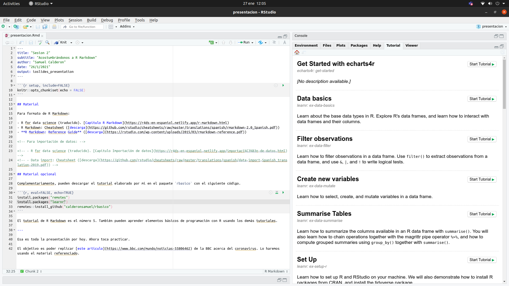

```{r setup, include=FALSE}
knitr::opts_chunk$set(echo = FALSE)
```

## Material

Para formato de R Markdown:

- R for data science (traducido). [Capítulo R Markdown](https://r4ds-en-espaniol.netlify.app/r-markdown.html)
- R Markdown: Cheatsheet ([descarga](https://github.com/rstudio/cheatsheets/raw/master/translations/spanish/rmarkdown-2.0_Spanish.pdf))
- **R Markdown: Reference Guide** ([descarga](https://rstudio.com/wp-content/uploads/2015/03/rmarkdown-reference.pdf))

<!-- Para importación de datos: -->

<!-- - R for data science (traducido). [Capítulo Importación de datos](https://r4ds-en-espaniol.netlify.app/importaci%C3%B3n-de-datos.html) -->
<!-- - Data import: Cheatsheet ([descarga](https://github.com/rstudio/cheatsheets/raw/master/translations/spanish/data-import-Spanish_translation-2019.pdf)) -->

## Material opcional

Complementariamente, pueden descargar el tutorial elaborado por mí en el paquete `rbasico` con el siguiente código.

```{r, eval=FALSE, echo=TRUE}
install.packages("remotes")
install.packages("learnr")
remotes::install_github("calderonsamuel/rbasico")
```

El tutorial "Rmarkdown" explica un poco de la teoría de R Markdown. 
También pueden aprender elementos básicos de programación con R usando los demás tutoriales.

---

Pueden encontrar los tutoriales en el panel "Tutorial" de RStudio (en la parte superior derecha).

{width=100%}

---

Esa es toda la presentación por hoy. Ahora toca practicar.

Ten a la mano la Guía de Referencia R Markdown (Reference Guide).

---

El objetivo es poder replicar [este artículo](https://www.bbc.com/mundo/noticias-55806462) de la BBC acerca del coronavirus. Lo haremos usando el material referenciado.

{width=100%}

## Encabezados

Los encabezados son la pieza de texto que nos permiten identificar las secciones de nuestro documento. Típicamente, los conocemos como títulos, títulos de sección, subtítulos, etc. Son además los nombres que normalmente podemos encontrar en los índices de un documento.


