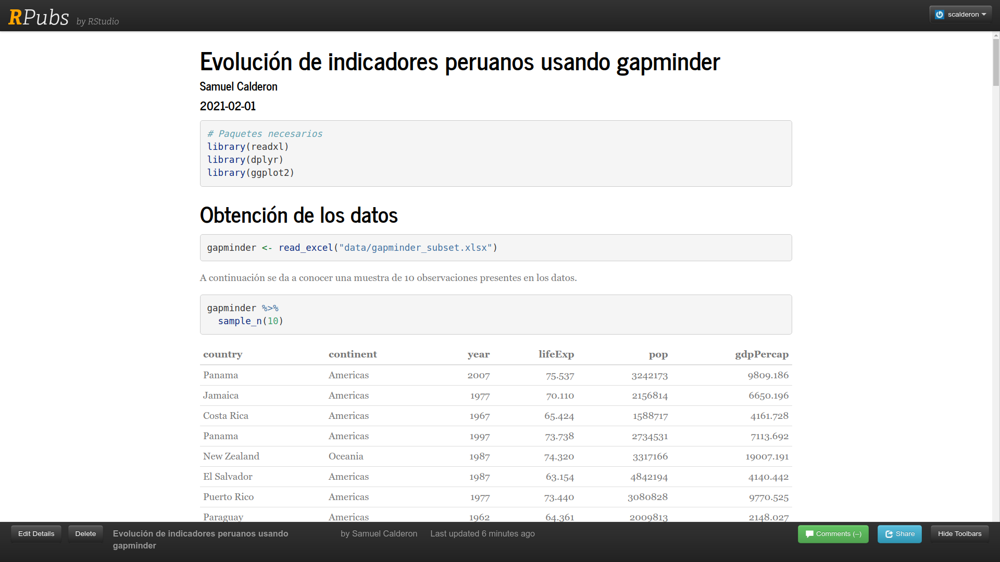

```{r setup, include=FALSE, message=FALSE, warning=FALSE}
knitr::opts_chunk$set(echo = FALSE)
library(readxl)
library(dplyr)
library(ggplot2)
```

## Requisitos

- Paquetes:
  - `rmarkdown`
  - `tidyverse`
- Data:
  - faithful.xlsx
  - gapminder_subset.xlsx
  - gapminder.xlsx

## Repaso 

1. Crear un nuevo proyecto en nuevo directorio: "repaso-sesion3"
2. Crear un nuevo archivo R Markdown:
    - Documento HTML
    - Título: "Repaso de lectura de datos"
    - Contenido:
        + Encabezado nivel 2: Lectura de datos
        + 1 Bloque de código en el que leen los datos: sólo "faithful.xslx"
        + Encabezado nivel 2: Aplicación de funciones
        + 3 bloques de código en los que se aplican las funciones `head()`, `tail()` y `str()` a la data.
3. Presentar el resultado de hacerle *Knit* al documento.
    
# Práctica con código

---

Se busca que los participantes se familiaricen con la lectura de código de análisis de datos. 

Para ello, se usarán funciones de los paquetes `readxl`, `dplyr` y `ggplot2`. 

Todos estos paquetes se incluyen en la descarga del paquete `tidyverse`.

En esta sesión **no** estaremos creando funciones propias.

# Traducción del código al lenguaje natural

---

Usaremos como ejemplo el código del siguiente documento.

<https://rpubs.com/scalderon/ejemplo-gapminder>

{width=90%}

## ¿Cómo leer este código? Ejemplo 1

```{r, echo=TRUE, eval=FALSE}
gapminder <- read_excel("data/gapminder.xlsx")
```

```{r}
gapminder <- read_excel("data/gapminder_subset.xlsx")
```

Considerar sus componentes

1. `gapminder`: *nombre de variable*
2. `<-`: *operador de asignación*
3. `read_excel()`: *función de lectura de datos provenientes de excel*
4. `"data/gapminder.xlsx"`: *ubicación del archivo Excel*

> Usar la función ***read_excel()*** para leer la tabla contenida en el archivo ***"data/gapminder.xlsx"*** y ***asignarle*** el nombre ***gapminder***.

## ¿Cómo leer este código? Ejemplo 2

```{r, echo=TRUE, eval=FALSE}
gapminder %>% 
  sample_n(10)
```

1. `gapminder`: objeto que contiene un *data.frame* o *tibble*
2. `%>%`: operador *pipe* para encadenar funciones
3. `sample_n()`: función para obtener una muestra aleatoria de *n* observaciones

> Tomar el objeto ***gapminder***, ***luego*** obtener una muestra aleatoria (***sample***) de 10 observaciones.

Toma en cuenta que la muestra aleatoria arrojará resultados distintos cada vez que se vuelva a correr el código.

---

```{r, echo=TRUE}
gapminder %>% 
  sample_n(10)
```

## ¿Cómo leer este código? Ejemplo 3

```{r, echo=TRUE}
gapminder <- gapminder %>% 
  rename(pais = country,
         continente = continent,
         año = year,
         expectativa_de_vida = lifeExp,
         poblacion = pop,
         pbi_per_capita = gdpPercap)
```

1. `gapminder` (izquierda): nombre de objeto de destino
2. `<-`: operador de asignamiento
3. `gapminder` (derecha): objeto que contiene un *data.frame* o *tibble*
4. `%>%`: operador *pipe* para encadenar funciones
5. `rename()`: función para renombrar las columnas de un *data.frame* o *tibble*

Todo lo contenido dentro de `rename()` sirve para indicar los nuevos nombres de las columnas.

---

```{r, echo=TRUE, eval=FALSE}
gapminder <- gapminder %>% 
  rename(pais = country,
         continente = continent,
         año = year,
         expectativa_de_vida = lifeExp,
         poblacion = pop,
         pbi_per_capita = gdpPercap)
```

> Tomar el objeto ***gapminder*** (derecha). ***Luego***, ***renombrar*** las columnas según el detalle. ***Asignarle*** el resultado de esta operación al objeto ***gapminder*** (izquierda).

---

Ahora al obtener una muestra aleatoria de `gapminder` obtenemos otros nombres de columnas.

```{r, echo=TRUE}
gapminder %>% 
  sample_n(10)
```

## ¿Cómo leer este código? Ejemplo 4

```{r echo=TRUE, eval=FALSE}
gapminder %>% 
  filter(año == "2007") %>% 
  count(continente)
```

1. `gapminder`: objeto que contiene un *data.frame* o *tibble*
2. `%>%`: operador *pipe* para encadenar funciones
3. `filter()`: función de filtrado de observaciones
4. `año = 2007`: condición para preservar las observaciones
5. `count()`: función para obtener un recuento de observaciones
6. `continente`: columna objetivo para el recuento

> Tomar el objeto ***gapminder***. ***Luego***, ***filtrar*** las observaciones, conservando aquellas en que el ***año sea 2007***. ***Luego***, ***contar*** las observaciones presentes en cada ***continente***.

---

```{r echo=TRUE}
gapminder %>% 
  filter(año == "2007") %>% 
  count(continente)
```

## ¿Cómo leer este código? Ejemplo 5

```{r, echo=TRUE, eval=FALSE}
gapminder %>% 
  filter(año == "2007") %>% 
  count(continente) %>% 
  ggplot(aes(x = continente, y = n)) +
  geom_col()
```

1. `gapminder`: objeto que contiene un *data.frame* o *tibble*
2. `%>%`: operador *pipe* para encadenar funciones
3. `filter()`: función de filtrado de observaciones
4. `año = 2007`: condición para preservar las observaciones
5. `count()`: función para obtener un recuento de observaciones
6. `continente`: columna objetivo para el recuento

---

```{r, echo=TRUE, eval=FALSE}
gapminder %>% 
  filter(año == "2007") %>% 
  count(continente) %>% 
  ggplot(aes(x = continente, y = n)) +
  geom_col()
```

7. `ggplot()`: función para iniciar la creación de un gráfico
8. `aes(x = continente, y = n)`: función para mapeo de variables a componentes de gráfico
9. `+`: operador de agregación de capas a gráficos
10. `geom_col()`: función de creación de gráfico de columnas

---

```{r, echo=TRUE, eval=FALSE}
gapminder %>% 
  filter(año == "2007") %>% 
  count(continente) %>% 
  ggplot(aes(x = continente, y = n)) +
  geom_col()
```

> Tomar el objeto ***gapminder***. ***Luego***, ***filtrar*** las observaciones, conservando aquellas en que el ***año sea 2007***. ***Luego***, ***contar*** las observaciones presentes en cada ***continente***.

> ***Luego***, ***iniciar un gráfico*** con el resultado de la operación anterior, en el que se ***mapee las variables*** `continente` en el eje *X* y `n` en el eje *Y*. A esto, ***agregarle una capa*** en la que se ***crea un gráfico de columnas*** según el mapeo previsto.

---

```{r, echo=TRUE}
gapminder %>% 
  filter(año == "2007") %>% 
  count(continente) %>% 
  ggplot(aes(x = continente, y = n)) +
  geom_col()
```

# Práctica

## Pasos iniciales

Paso 1: Creamos un nuevo proyecto (dentro de la carpeta "R")

    Menú File > 
      New Proyect > 
      New Directory > 
      New Proyect > 
      Elegir nombre y ubicación > 
      Create project

Paso 2: Creamos un nuevo archivo R Markdown

    Menú File > 
      New File > 
      R Markdown > 
      Configurar nombre de autor >
      Ok
      
---

El objetivo es crear un nuevo reporte similar a [Evolución de indicadores peruanos usando gapminder](https://rpubs.com/scalderon/ejemplo-gapminder). 

- Archivo de datos: "data/gapminder.xlsx"
- País objetivo: Estados Unidos (United States)
- Comparación entre dos países: Estados Unidos y China (China)
- Comparación entre grupo de países: Países miembros permanentes del consejo de seguridad de la ONU
  - Estados Unidos
  - China
  - Francia (France)
  - Reino Unido (United Kingdom)
  - Rusia (no va a usar porque no existe dentro de gapminder)
  
---

Opcionalmente, se pueden usar las mismas opciones en el encabezado YAML del documento R Markdown.

```
---
title: "Evolución de indicadores peruanos usando gapminder"
author: "Samuel Calderon"
date: "2021-02-01"
output: 
  html_document:
    theme: journal
    highlight: pygments
    df_print: kable
---
```
